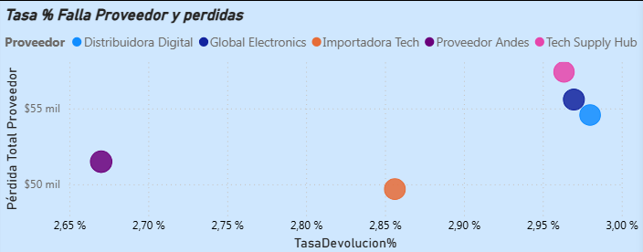
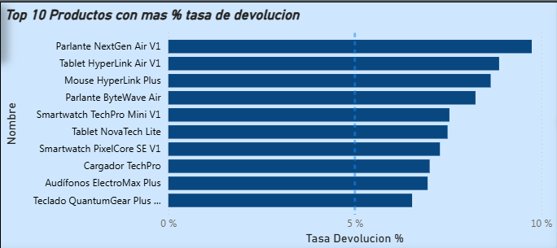
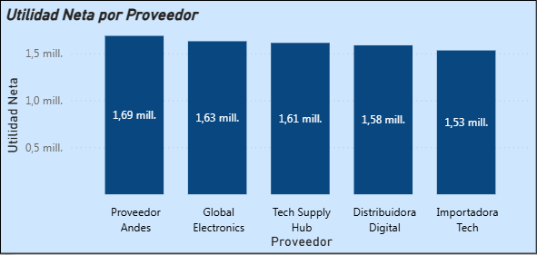

# Proyecto de analisis de ventas y calidad de productos

## Contexto del negocio

La empresa necesita entender cómo las fallas de calidad están afectando ventas, rentabilidad y experiencia de cliente.

Esto dificulta responder preguntas clave como:

- ¿Que productos presentan mas fallas?
- ¿Cuales son los proveedores que entregan productos con mas fallas ?
- ¿Que impacto economico tiene estas devoluciones?
- ¿Qué tan confiables son los datos?

El objetivo de este proyecto es transformar datos desordenados en información accionable para la toma de decisiones.

## Fuentes de datos

Se integraron múltiples archivos de diferentes fuentes:

- Fuente 1: Ventas
  Archivo CSV exportado desde el ERP "ventas_erp_50000.csv"
  
- Fuente 2: Calidad / devoluciones
  Archivo Excel del área de postventa "devoluciones_calidad_2000.xlsx"

- Fuente 3: Catálogo maestro de productos
  Archivo JSON o tabla SQL "catalogo_tecnologia_500_v2.json"

Los datos presentan problemas reales como:

- Nombres inconsistentes
- Espacios
- Formatos distintos
- Diferentes formas de escribir lo mismo
- Registros duplicados
- Valores faltantes

## Proceso de análisis

Parte del proyecto fue desarrollado en Python utilizando pandas y para en analisis PowerBI

Etapas principales:

1. Carga de múltiples fuentes de datos
2. Diagnóstico de calidad de datos
3. Limpieza y estandarización
4. Validaciones de negocio
5. Cruce de tablas (joins)
6. Construcción de base consolidada
7. Cálculo de KPIs
8. Análisis de impacto económico
9. Visualización de resultados

Implementé una tabla calendario en Power BI para habilitar análisis temporal y métricas de inteligencia de tiempo

## Resultados clave

### Productos con mas tasa de devolucion

Algunos productos alcanzan tasas cercanas al 10% de devolución, lo cual es significativamente alto.
Productos como 

- Parlante NextGen Air V1
- Tablet HyperLink Air V1
- Mouse Hyperlink plus
  
indicando posibles problemas de calidad, defectos o mala experiencia de uso.

No necesariamente son los productos más vendidos, pero sí los más críticos en términos de desempeño relativo.

### Proveedores con mas tasa de falla en sus productos y mas perdida

Existen proveedores con tasas similares (~2.8% – 3.0%), pero con impactos económicos muy distintos
Proveedores como Tech Supply Hub y Global Electronics presentan: altas tasas de devolución y también altas pérdidas económicas.

En cambio, otros proveedores con menor tasa no necesariamente generan menor impacto

### Utilidad neta por proveedor

Aunque los proveedores presentan niveles de utilidad similares, algunos destacan por generar mayor rentabilidad, lo que puede estar asociado a mejores márgenes o menor impacto de devoluciones.
Alta utilidad no siempre significa mejor proveedor puede deberse a:
- Mayor volumen de ventas
- Mejores márgenes
- Menor tasa de fallas

### Top 5 productos mas vendidos e ingresos netos

Se identificó que no todos los productos con alto volumen de ventas generan el mismo nivel de ingresos, lo que evidencia diferencias en precios o posicionamiento dentro del portafolio. 

## Visualizaciones

